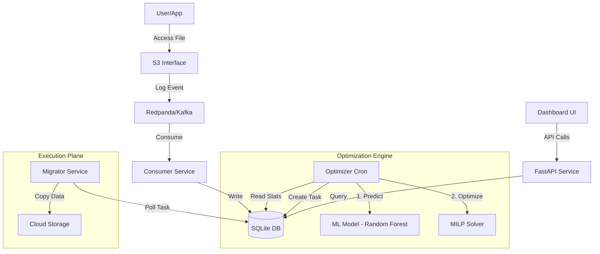

# System Architecture & Codebase Tour

This document provides a comprehensive technical deep dive into the **Data-in-Motion** architecture, mapping every feature to its exact implementation in the codebase.

---

## 1. High-Level Architecture

The system follows a **Microservices Event-Driven Architecture**:



### Core Components
1.  **API Service** (`app/services/api.py`): FastAPI-based gateway. Handles metadata, serves the dashboard API, and exposes metrics.
2.  **Consumer** (`app/services/stream/consumer.py`): Listens to the `file_access` Kafka topic. Aggregates raw events into 1h/24h windows.
3.  **Optimizer** (`app/services/optimizer/`): Background process that combines ML predictions with MILP optimization to generate migration tasks.
4.  **Migrator** (`app/services/migrator/service.py`): Resilient worker that executes data movement with retries, checksum verification, and atomic metadata updates.
5.  **Dashboard** (`app/dashboard/streamlit_app.py`): Streamlit-based UI for monitoring and control.

---

## 2. Feature Implementation Guide

This section maps **every feature** to its exact code location and implementation logic.

---

### A. Core ML & Optimization Features

#### 1. Predictive AI (Random Forest)
**What**: Predicts future file popularity (`p_hot`) to pre-warm data before traffic spikes.

**Implementation**:
*   **Training**: `app/ml/train_tiers.py`
    *   Trains a Random Forest Classifier on historical access patterns
    *   Features: `access_1h`, `access_24h`, `recency_s`, `hour_of_day`, `day_of_week`, `partial_upload`
    *   Saves model to `/app/models/tier.bin`
*   **Serving**: `app/ml/serve_tiers.py`
    *   Function: `predict_proba(feat: dict) -> float`
    *   Loads the `.bin` model, featurizes inputs, returns probability (0.0-1.0)
    *   Used by optimizer to determine if file is "hot" (>0.7), "warm", or "cold" (<0.3)

**How to Verify**:
```bash
# Check model exists
docker compose exec api ls -lh /app/models/tier.bin

# Test prediction via API
curl http://localhost:8000/explain/logs/2025-11-06/app.log | jq '.p_hot'
```

---

#### 2. Mathematical Optimization (MILP)
**What**: Solves for the mathematically optimal data placement (Min Cost + Latency Penalty).

**Implementation**:
*   **File**: `app/services/optimizer/placement_milp.py`
*   **Function**: `solve_placement(sites, rf, sla_ms, site_scores, score_weight)`
*   **Logic**:
    1.  Defines a **PuLP** linear programming problem
    2.  **Objective Function**: 
        ```python
        Minimize(
            Sum(Cost_per_GB) + 
            0.001 * Sum(max(0, Latency - SLA)) -
            score_weight * Sum(site_preference_scores)
        )
        ```
    3.  **Constraints**:
        *   `Sum(selected_sites) == RF` (Replication Factor)
        *   `At least 1 site must meet SLA`
        *   `Provider Diversity`: No more than 1 replica per cloud provider (if RF>1)
*   **Called by**: `app/services/optimizer/model.py` → `optimize_placement()`

**How to Verify**:
```bash
# View placement decision for a file
curl http://localhost:8000/explain/logs/2025-11-06/app.log | jq '.chosen, .objective'
```

---

### B. Edge Case Handling Features

#### 3. Resilience & Exponential Backoff
**What**: Handles cloud provider rate limits (`429 Too Many Requests`, `503 Service Unavailable`) gracefully.

**Implementation**:
*   **File**: `app/services/migrator/service.py`
*   **Function**: `_ensure_and_copy_once()` (Lines 101-119)
*   **Logic**:
    ```python
    max_retries = 3
    backoff = 1
    for attempt in range(max_retries + 1):
        try:
            # Attempt copy
            obj = s.get_object(Bucket=sb, Key=key)
            d.put_object(Bucket=db, Key=key, Body=body)
            return {"status": "copied"}
        except ClientError as e:
            code = e.response.get("Error", {}).get("Code")
            if code in ("429", "503", "Throttling", "TooManyRequests", "SlowDown"):
                if attempt < max_retries:
                    time.sleep(backoff)  # Wait 1s, 2s, 4s
                    backoff *= 2
                    continue
            raise e
    ```

**How to Verify**:
*   Simulate throttling by injecting high load
*   Check logs: `docker compose logs -f api | grep "Retrying"`

---

#### 4. Growing File Detection (Partial Upload Handling)
**What**: Prevents migrating files that are still being written to.

**Implementation**:
*   **File**: `app/services/migrator/service.py`
*   **Function**: `_ensure_and_copy_once()` (Lines 84-99)
*   **Logic**:
    ```python
    # Check if file was modified very recently
    head = s.head_object(Bucket=sb, Key=key)
    last_modified = head.get("LastModified")
    if last_modified:
        now = datetime.datetime.now(last_modified.tzinfo)
        if (now - last_modified).total_seconds() < 5:
            return {"status": "skipped", "reason": "file_growing"}
    ```
*   **ML Feature**: `partial_upload` feature in the Random Forest model
    *   **File**: `app/ml/prepare_dataset.py` (Line 23)
    *   Simulates 5% chance of partial upload in training data

**How to Verify**:
*   Upload a file and immediately trigger migration
*   Check task status: `curl http://localhost:8000/tasks | jq '.[] | select(.error | contains("file_growing"))'`

---

#### 5. Encryption Enforcement
**What**: Blocks migrations to unencrypted destinations when encryption policy is enabled.

**Implementation**:
*   **Policy File**: `app/services/policy/security.py`
    *   `is_encryption_enforced() -> bool`: Checks if encryption is required
    *   `endpoint_is_encrypted(name) -> bool`: Verifies endpoint encryption status
*   **Enforcement**: `app/services/migrator/service.py` (Lines 49-50)
    ```python
    if security.is_encryption_enforced() and not security.endpoint_is_encrypted(dst):
        return {"status": "blocked", "reason": "destination_not_encrypted"}
    ```
*   **API Endpoints**:
    *   `GET /policy/security`: Check current policy
    *   `POST /policy/security`: Toggle enforcement

**How to Verify**:
```bash
# Enable encryption enforcement
curl -X POST http://localhost:8000/policy/security -H "Content-Type: application/json" -d '{"enforce": true}'

# Try to migrate to unencrypted endpoint (should fail)
curl -X POST http://localhost:8000/optimize/some-file
```

---

### C. Chaos Engineering Features

#### 6. Endpoint Failure Simulation
**What**: Simulates network failures to test system resilience.

**Implementation**:
*   **State Management**: `app/services/policy/chaos.py`
    *   `fail_endpoint(name)`: Adds endpoint to failure list
    *   `recover_endpoint(name)`: Removes endpoint from failure list
    *   `get_failed_endpoints()`: Returns list of failed endpoints
*   **Enforcement**: `app/services/common/s3_client.py` (Lines 11-12)
    ```python
    def client_for(name: str):
        if name in chaos.get_failed_endpoints():
            raise RuntimeError(f"Endpoint {name} is in chaos fail list")
    ```
*   **API Endpoints**:
    *   `POST /chaos/fail/{name}`: Fail an endpoint
    *   `POST /chaos/recover/{name}`: Recover an endpoint
    *   `POST /chaos/clear`: Clear all failures

**How to Verify**:
```bash
# Fail Azure endpoint
curl -X POST http://localhost:8000/chaos/fail/azure

# Trigger migration to Azure (will fail and retry)
curl -X POST http://localhost:8000/optimize/some-file

# Check logs
docker compose logs -f api | grep "chaos fail list"
```

---

#### 7. Latency Injection
**What**: Injects artificial latency to verify system doesn't timeout.

**Implementation**:
*   **State Management**: `app/services/policy/chaos.py`
    *   `set_latency(ms)`: Sets latency in milliseconds
    *   `get_latency()`: Returns current latency setting
*   **Enforcement**: `app/services/migrator/service.py` (Lines 52-57)
    ```python
    from ..policy import chaos
    lat = chaos.get_latency()
    if lat > 0:
        time.sleep(lat / 1000.0)  # Convert ms to seconds
    ```

**How to Verify**:
```bash
# Inject 2000ms latency
docker compose exec api python -c "from app.services.policy import chaos; chaos.set_latency(2000)"

# Trigger migration (will be slow)
time curl -X POST http://localhost:8000/optimize/some-file
```

---

### D. Dashboard UI Features

#### 8. Burst 100 (Traffic Simulation)
**What**: Simulates 100 access events to a file to trigger tier changes.

**Implementation**:
*   **API Endpoint**: `POST /simulate`
    *   **File**: `app/services/api.py` (Lines 105-141)
    *   **Logic**:
        1.  Increments `access_1h` and `access_24h` counters by `events` (default 100)
        2.  Inserts `events` rows into `access_event` table
        3.  Calls `evaluate_and_queue(key)` to trigger optimization
        4.  Increments Prometheus metric `simulate_events_total`
*   **Dashboard**: `app/dashboard/streamlit_app.py`
    *   Button: "Burst 100 Hits"
    *   Calls: `requests.post(f"{API_URL}/simulate", params={"key": selected_file, "events": 100})`

**How to Verify**:
1.  Open dashboard: http://localhost:8050
2.  Select a file
3.  Click "Burst 100"
4.  Watch heat score increase in real-time

---

#### 9. Placement Explain Tab
**What**: Shows the MILP solver's decision-making process.

**Implementation**:
*   **API Endpoint**: `GET /explain/{key}`
    *   **File**: `app/services/api.py` (Lines 158-200)
    *   **Returns**:
        ```json
        {
          "objective": -0.537,
          "chosen": ["aws", "azure"],
          "sla_ms": 80,
          "rf": 2,
          "p_hot": 0.85,
          "scores": {"aws": 2.1, "azure": 1.8, "gcp": 1.2},
          "sites": [...]
        }
        ```
*   **Dashboard**: `app/dashboard/streamlit_app.py`
    *   Tab: "Placement Explain"
    *   Displays JSON in formatted view

**How to Verify**:
```bash
curl http://localhost:8000/explain/logs/2025-11-06/app.log | jq
```

---

#### 10. Insights Tab
**What**: Displays ML model predictions and feature importance.

**Implementation**:
*   **API Endpoint**: `GET /debug/placement/{key}`
    *   **File**: `app/services/api.py` (Lines 202-291)
    *   **Returns**:
        ```json
        {
          "key": "...",
          "db_before": {...},
          "windows": {"c1": 150, "c24": 500},
          "prediction": {"p": 0.85, "p_adj": 0.78},
          "heat": {"score": 0.92, "boosted": 0.95},
          "recommended": {"tier": "hot", "primary": "aws"}
        }
        ```
*   **Dashboard**: `app/dashboard/streamlit_app.py`
    *   Tab: "Insights"
    *   Shows prediction breakdown

**How to Verify**:
```bash
curl "http://localhost:8000/debug/placement/logs/2025-11-06/app.log?run=false" | jq
```

---

### E. Observability Features

#### 11. Prometheus Metrics
**What**: Exposes system metrics for monitoring.

**Implementation**:
*   **File**: `app/services/observability/metrics.py`
*   **Metrics**:
    *   `simulate_events_total`: Counter for simulated events
    *   `migration_jobs_total`: Counter for migration tasks (by result)
    *   `migration_queue_gauge`: Gauge for queue depth (by status)
*   **Endpoint**: `GET /metrics`
    *   **File**: `app/services/api.py` (Lines 338-340)

**How to Verify**:
```bash
curl http://localhost:8000/metrics | grep migration
```

---

#### 12. Alerting System
**What**: Creates alerts for anomalies (e.g., migration backlog).

**Implementation**:
*   **File**: `app/services/observability/alerts.py`
*   **Logic**: `app/services/migrator/service.py` (Lines 25-31)
    ```python
    queued = counts.get("queued", 0)
    if queued > 20:
        alerts.create_alert(
            "migration_backlog",
            "warning",
            f"{queued} migration tasks queued",
            {"queued": queued}
        )
    ```
*   **API Endpoints**:
    *   `GET /alerts`: List active alerts
    *   `POST /alerts/{id}/ack`: Acknowledge alert
    *   `POST /alerts/clear`: Clear all alerts

**How to Verify**:
```bash
curl http://localhost:8000/alerts | jq
```

---

## 3. Data Flow Walkthrough

### Scenario: User Bursts a File

1.  **User Action**: Clicks "Burst 100" in dashboard
2.  **API Call**: `POST /simulate?key=file.txt&events=100`
3.  **DB Update**: `access_1h += 100`, `access_24h += 100`
4.  **Optimizer Triggered**: `evaluate_and_queue(key)`
5.  **ML Prediction**: `serve_tiers.predict_proba()` → `p_hot = 0.85`
6.  **MILP Solve**: `placement_milp.solve_placement()` → `chosen = ["aws"]`
7.  **Migration Task**: Created if current location ≠ optimal
8.  **Migrator**: Polls task, executes copy with retry logic
9.  **Metrics**: Updates Prometheus counters
10. **Dashboard**: Refreshes to show new tier

---

## 4. Testing & Verification Commands

```bash
# 1. Verify ML model exists
docker compose exec api ls -lh /app/models/tier.bin

# 2. Test prediction
curl http://localhost:8000/explain/logs/2025-11-06/app.log | jq '.p_hot'

# 3. Test MILP solver
curl http://localhost:8000/explain/logs/2025-11-06/app.log | jq '.objective, .chosen'

# 4. Test resilience (check logs for retry)
docker compose logs -f api | grep -i retry

# 5. Test chaos controls
curl -X POST http://localhost:8000/chaos/fail/azure
curl http://localhost:8000/chaos/status

# 6. Test encryption policy
curl -X POST http://localhost:8000/policy/security -H "Content-Type: application/json" -d '{"enforce": true}'

# 7. View metrics
curl http://localhost:8000/metrics | grep migration

# 8. View alerts
curl http://localhost:8000/alerts | jq
```
