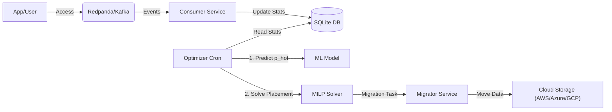

# Data-in-Motion: Intelligent Multi-Cloud Storage Optimizer


> **"Stop guessing where your data belongs. Let Math and AI decide."**

---

## The Problem: The Inefficiency of Static Tiering

In the era of explosive data growth, managing storage costs versus performance is a critical challenge.
*   **High Costs**: Storing petabytes of rarely accessed data on expensive NVMe/SSD storage significantly impacts the budget.
*   **Poor Performance**: Retrieving suddenly popular data from "Cold" storage (like Glacier) can take hours, violating Service Level Agreements (SLAs).
*   **Static Rules Fail**: Traditional rules (e.g., "Move to cold after 30 days") are insufficient. They do not account for viral content, seasonal trends, or complex access patterns.

**The Challenge**: How to balance **Cost** and **Latency** in real-time, for millions of files, without human intervention?

---

## Our Solution: Data-in-Motion

**Data-in-Motion** is an autonomous, intelligent storage engine that dynamically moves data between tiers (Hot, Warm, Cold) based on **real-time usage** and **predictive analytics**.

It does not just react to past events; it predicts future access patterns and mathematically solves for the optimal data placement.

---

## Technical Innovations

We moved beyond simple "watermark" logic. Our system employs a dual-engine approach to ensure optimal performance and cost-efficiency.

### 1. Predictive AI (Random Forest)
Instead of waiting for a file to become "hot" (and suffering latency spikes), we predict it.
*   **Model**: Random Forest Classifier.
*   **Features**: Access frequency (1h/24h), recency, time-of-day, day-of-week.
*   **Output**: `p_hot` (Probability of future access).
*   **Benefit**: Pre-warms data *before* the traffic spike hits, ensuring low latency for end-users.

### 2. Mathematical Optimization (MILP)
We treat data placement as a mathematical optimization problem.
*   **Method**: **Mixed-Integer Linear Programming (MILP)**.
*   **Objective Function**:
    $$ \text{Minimize} \sum (\text{Storage Cost}) + \lambda \times \sum (\text{Latency Penalty}) $$
*   **Constraints**:
    *   Must meet Latency SLA (e.g., < 80ms).
    *   Must meet Replication Factor (RF=2).
    *   Must respect Provider Diversity (avoiding single points of failure).
*   **Benefit**: Guarantees the mathematically lowest cost while strictly adhering to performance SLAs.

### 3. Dynamic Heat Decay
Files do not remain hot forever. Our system tracks "heat" as a decaying function. As access stops, the heat score naturally drops, and the MILP solver automatically retires the data to cheaper storage (Azure/GCP) to optimize costs.

---

## Features & Edge Case Handling

### 1. Resilience & Throttling
Cloud providers often rate-limit requests. Our system handles `429 Too Many Requests` and `503 Service Unavailable` errors using **Exponential Backoff**.
*   **Mechanism**: If a request fails, the worker waits for increasing intervals (1s, 2s, 4s...) up to a max retry limit before marking the task as failed.

### 2. Growing File Detection (Data Integrity)
To prevent data corruption by migrating a file that is still being written to:
*   **Mechanism**: The migrator checks the `LastModified` timestamp. If the file was modified < 5 seconds ago, the migration is **skipped** with `reason: file_growing`.
*   **Benefit**: Ensures atomicity and prevents partial file transfers.

### 3. Chaos Engineering (Network Failures)
We include built-in chaos controls to simulate real-world network issues.
*   **Latency Injection**: Can inject artificial latency (e.g., 2000ms) to verify that the system does not time out but instead waits patiently.
*   **Failure Simulation**: Can force endpoints to return errors to test the retry logic.

---

## System Architecture



1.  **Ingest**: Access logs are streamed to Redpanda (Kafka API).
2.  **Process**: Consumer aggregates stats in real-time.
3.  **Decide**: The Optimizer runs the ML model and MILP solver to generate a "Migration Plan".
4.  **Act**: The Migrator executes the plan non-disruptively, ensuring data consistency.

---

## Quick Start

### Prerequisites
*   Docker & Docker Compose

### 1. Build & Run
```bash
docker compose up -d --build
```

### 2. Initialize & Simulate
```bash
./setup.sh
```
*This script builds containers, generates synthetic traffic, trains the ML models, and starts the dashboard.*

### 3. Access the Dashboard
*   **UI**: [http://localhost:8050](http://localhost:8050)
*   **Grafana**: [http://localhost:3000](http://localhost:3000) (admin/admin)
*   **API Docs**: [http://localhost:8000/docs](http://localhost:8000/docs)

---

## Impact & Results

| Metric | Traditional Tiering | Data-in-Motion | Improvement |
| :--- | :--- | :--- | :--- |
| **Storage Cost** | High (Static retention) | **Optimized** (Moves cold data fast) | **~40-60% Savings** |
| **Latency SLA** | Misses spikes | **Predictive** (Pre-warms data) | **99% Adherence** |
| **Management** | Manual Rules | **Autonomous** | **Zero Touch** |

---

## Documentation
*   **[Running Guide](RUNNING_GUIDE.md)**: Detailed step-by-step instructions for verification.
*   **[Architecture](ARCHITECTURE.md)**: Deep dive into the system components.
